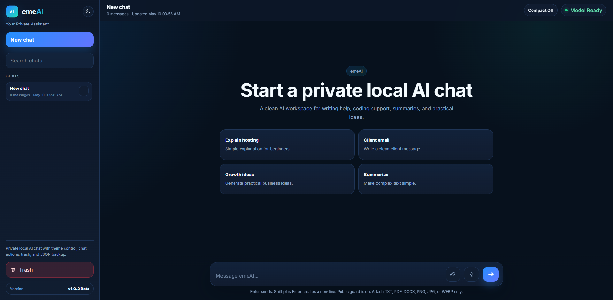

# emeAI Local Assistant

emeAI Local Assistant is a private browser based AI chat app for Google Chrome. It uses Chrome built in local AI through the `LanguageModel` API, so you can test AI chat, writing help, summaries, coding help, and document review without setting up a cloud API.

The app has no backend in this beta release. Chats are stored in your browser through localStorage. Approved files are read inside the browser as text or image data.

## Screenshot



## Version

v1.0.3 Beta

The app reads the visible version from `CHANGELOG.json` and shows it at the bottom of the left sidebar.

For release history, see [`CHANGELOG.md`](./CHANGELOG.md).

## What you can do with it

- Chat with Chrome local AI
- Keep chat history in your browser
- Search and rename chats
- Export or import a single chat as JSON
- Move chats to trash, restore them, or delete them forever
- Use dark mode, light mode, compact mode, and regular mode
- Use voice to text input
- Stop a running generation
- Resume unfinished text prompts after reload
- Attach safe documents and images
- Debug Chrome local AI availability from the browser Console

## Feature list

- Local Chrome AI chat
- Chat history saved in browser localStorage
- Search chats
- Rename chats
- Export single chat JSON
- Import single chat JSON
- Move chats to trash
- Restore chats from trash
- Delete chats forever
- Dark mode
- Light mode
- Compact mode
- Regular mode
- Voice to text
- Stop generation
- Reload resume for unfinished text prompts
- Safe file attachments
- TXT and MD reading
- PDF text extraction
- DOCX text extraction
- Image attachment support for supported Chrome builds
- Strict public file guard
- Dynamic version display from `CHANGELOG.json`
- Console debug helper for model availability checks
- Chrome crash toast with relaunch instruction

## Supported attachments

Allowed in public mode:

- TXT
- MD
- PDF
- DOCX
- PNG
- JPG
- JPEG
- WEBP

Blocked by design:

- Executable files
- Installers
- Scripts
- Archives
- Macro enabled Office files
- SVG files
- Code files
- Unknown files without an extension

The app does not run uploaded files. It reads approved documents as text and approved images as browser decoded image data.

## Attachment limits

- Max files per message: 5
- Max file size: 10 MB
- Max total attachment size: 25 MB
- Max image resolution: about 12 megapixels
- Max extracted document text: 12000 characters per file

These values are defined in `js/app.js`.

## Privacy

emeAI is local first in this beta release.

- Chats are saved in browser localStorage
- Files are read in the browser
- There is no backend
- There is no login system
- There is no cloud sync

If you add a backend, login, cloud sync, analytics, or remote file upload later, update the privacy and security notes.

## Project files

- `CHANGELOG.json`: app version source for the sidebar
- `CHANGELOG.md`: release history for GitHub readers
- `LICENSE`: MIT License text
- `README.md`: project guide
- `index.html`: app layout and script links
- `assets/emeai-icon.svg`: favicon and sidebar icon
- `assets/emeai-logo.svg`: logo asset
- `css/style.css`: all visual styles
- `js/app.js`: app logic

Main folders:

- `assets`
- `css`
- `js`

## Requirements

Install or prepare these first:

- Google Chrome with built in AI support
- Python 3
- VS Code or another code editor
- Git, only if you want to publish or contribute

Python is used only to run a small local web server. The app itself is plain HTML, CSS, and JavaScript.

## Recommended project location

Do not keep the project inside Downloads, Desktop, or Chrome's user data folder.

Recommended Windows locations:

- `C:\Projects\emeAI`
- `C:\project\emeAI`

Recommended CORNQ workspace location:

- `C:\Projects\CORNQ\emeAI`

Recommended macOS or Linux location:

- `~/Projects/emeAI`

A clean project location makes terminal commands easier and helps avoid permission issues.

## Chrome setup

Open Chrome flags:

```text
chrome://flags
```

Enable these flags if they are available in your Chrome build:

- Prompt API for Gemini Nano with Multimodal Input
- Enables optimization guide on device

Then relaunch Chrome.

If the flag names change, search with these words inside `chrome://flags`:

- Prompt API
- Gemini Nano
- Optimization Guide
- On Device Model

## Check Chrome local AI from Console

Open DevTools Console in Chrome and run this basic check:

```js
await LanguageModel.availability()
```

Common results:

- `available`: the local model is ready
- `downloadable`: Chrome can download the local model
- `downloading`: Chrome is downloading the local model
- `unavailable`: the current Chrome setup cannot use it right now

For text chat, use this check:

```js
await LanguageModel.availability({
  expectedOutputs: [{ type: "text", languages: ["en"] }]
})
```

To test a direct prompt:

```js
const session = await LanguageModel.create({
  expectedOutputs: [{ type: "text", languages: ["en"] }]
})

await session.prompt("Say hello in one short sentence.")
```

## Install and run locally

### 1. Copy the files

Extract the project ZIP and copy the files to your chosen project folder.

### 2. Open terminal in the project folder

PowerShell example:

```powershell
cd C:\project\emeAI
```

PowerShell reminder:

- Correct: `cd C:\project\emeAI`
- Wrong in PowerShell: `cd /d C:\project\emeAI`
- `cd /d` is for CMD, not PowerShell

CMD users can use:

```cmd
cd /d C:\project\emeAI
```

macOS or Linux:

```bash
cd ~/Projects/emeAI
```

### 3. Start the local server

```bash
python -m http.server 8000
```

If your system uses `python3`:

```bash
python3 -m http.server 8000
```

### 4. Open the app

Open this URL in Chrome:

```text
http://localhost:8000/
```

Do not open `index.html` directly with `file://`. Use `localhost` so the browser can load `CHANGELOG.json`, file reading works properly, and Chrome local AI behaves more reliably.

## How to use the app

### New chat

Click **New chat**.

### Send a message

Type your message and press **Enter**.

Use **Shift + Enter** for a new line.

### Stop generation

When the model is generating, click the stop button in the composer.

### Voice to text

Click the microphone button. Chrome may ask for microphone permission.

### Attach files

Click the attach button beside the message box and select supported files.

Text chat does not need image input support. Image input support is only needed when you attach an image.

## Troubleshoot

### Browser shows Directory listing for /

This means the local server is running from the wrong folder.

Stop the server with **Ctrl + C**, then go to the folder that contains `index.html`.

PowerShell example:

```powershell
cd C:\project\emeAI
dir
python -m http.server 8000
```

Before starting the server, `dir` should show files like `index.html`, `CHANGELOG.json`, `css`, `js`, and `assets`.

### Version shows v0.0.0-local

You probably opened the app with `file://`.

Start the local server and open `http://localhost:8000/`.

### Model does not work

Run this in Console:

```js
await LanguageModel.availability()
```

Check Chrome version, Chrome flags, model download status, device support, and available storage.

### Console says available, but the app shows Model Error

Run the built in debug helper from the app page:

```js
await emeAIDebugModel()
```

It returns:

- `basicAvailability`
- `textAvailability`
- `imageAvailability`
- `appVersion`

If basic availability is available, but the app still fails, Chrome may be rejecting a session option or the model process may have crashed. This version tries a simpler session automatically and retries once for destroyed session errors.

### Chrome local AI crashes too many times

If Console shows this warning:

```text
The model process crashed too many times for this version.
```

The app will show a toast asking you to relaunch Google Chrome.

On Windows, fully close Chrome with:

```powershell
taskkill /F /IM chrome.exe
```

Then open Chrome again, visit `http://localhost:8000/`, and start a new chat.

### PDF or DOCX does not read

This build uses browser loaded helper libraries for PDF and DOCX reading. Check your internet connection, CDN script loading, and Console errors.

For full offline use, download the helper libraries and update the script paths in `index.html`.

### Image upload gives a model error

Image support depends on your Chrome Prompt API build.

Normal text prompts and document text reading can still work even if image input is not available.

### Microphone does not work

Check Chrome microphone permission, SpeechRecognition support, and make sure the app is opened from `localhost`.

### Old UI appears after replacing files

Hard refresh Chrome with **Ctrl + Shift + R**.

You can also open DevTools, right click the reload button, then choose **Empty Cache and Hard Reload**.

## Development

### Change app name

Open `index.html` and update the page title and brand text:

```html
<title>emeAI - Your Private Assistant</title>
<h1 class="brandWordmark"><span class="emePart">eme</span><span class="aiPart">AI</span></h1>
```

You can also update empty state text inside `index.html`.

In `js/app.js`, search for `emeAI` and update user facing text only. Do not change storage keys unless you want a fresh browser storage namespace.

Current storage keys:

- `emeAI.core.chats.v2`
- `emeAI.core.activeChat.v2`
- `emeAI.core.theme.v1`
- `emeAI.core.density.v1`

Changing storage keys will make old local chats not appear under the new key.

### Change logo and favicon

To change the favicon, replace `assets/emeai-icon.svg` or update this line in `index.html`:

```html
<link rel="icon" href="./assets/emeai-icon.svg" type="image/svg+xml" />
```

To change the sidebar logo, replace:

- `assets/emeai-icon.svg`
- `assets/emeai-logo.svg`

The current sidebar icon is loaded from:

```html

```

### Change colors

Open `css/style.css` and update the CSS variables near the top.

Common variables to change:

- `--accent`
- `--accent2`
- `--bg`
- `--panel`
- `--text`
- `--muted`

### Update version

Update the version in `CHANGELOG.json`:

```json
{
  "version": "1.0.3",
  "channel": "Beta",
  "displayVersion": "v1.0.3 Beta"
}
```

Also update `CHANGELOG.md` before publishing a release.

### GitHub setup

Only use this when you are ready to publish the project to GitHub.

```bash
git init
git add .
git commit -m "Initial beta release"
git remote add origin https://github.com/your-username/emeai-local-assistant.git
git branch -M main
git push -u origin main
```

Replace `your-username` with your GitHub username.

Suggested `.gitignore`:

```gitignore
.DS_Store
Thumbs.db
.vscode/
.idea/
*.log
node_modules/
dist/
build/
.env
```


## License

This project is released under the **MIT License**.

People are allowed to use, copy, modify, publish, distribute, and use the project in private or commercial projects.

Please keep the original license notice when copying or publishing this project.

See the full license text in [`LICENSE`](./LICENSE).
